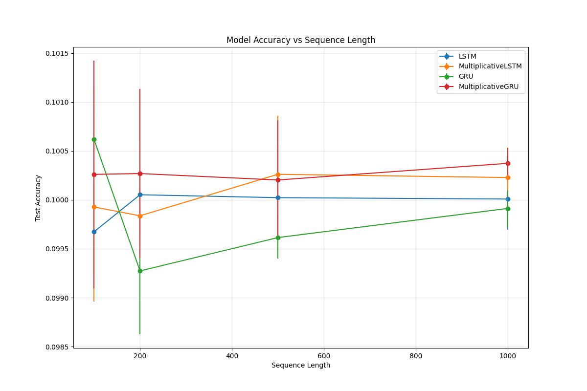
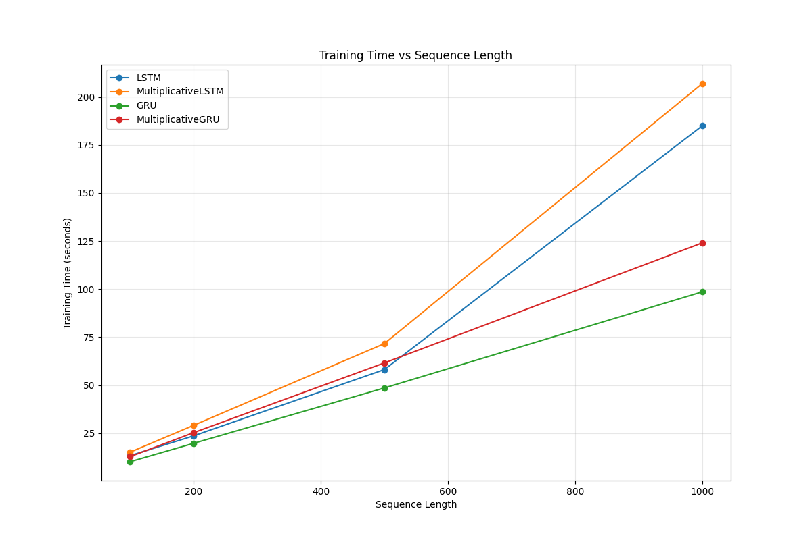
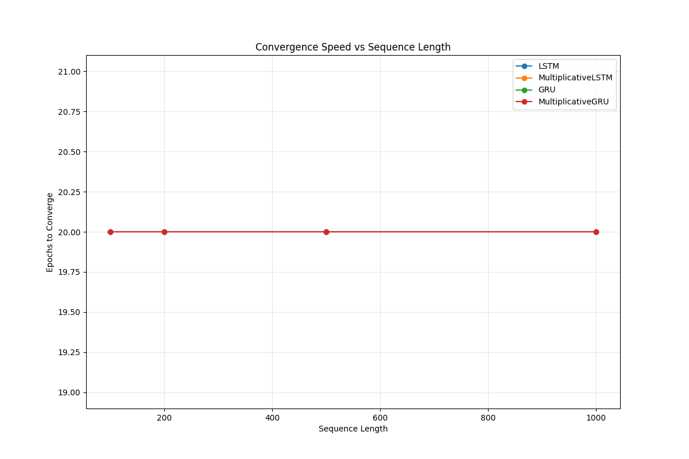
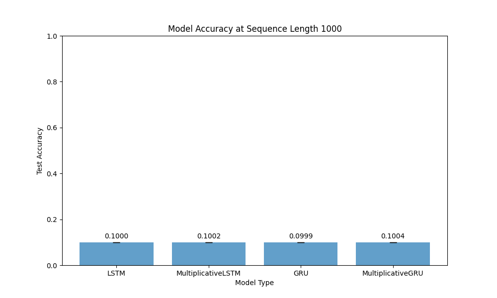

# LSTM and GRU vs. Multiplicative Variants on the Copy Task

## Abstract

This report evaluates four recurrent neural network architectures—standard LSTM, multiplicative LSTM, standard GRU, and multiplicative GRU—on the Copy Task, a benchmark designed to test a model’s ability to memorize and reproduce a sequence after a delay. I train each architecture on sequences of increasing length (100, 200, 500, and 1000 tokens) and measure final test accuracy, convergence speed, and training time. Despite theoretical advantages of multiplicative gating, all models converge near a trivial solution of predicting a single token with 10% accuracy, indicating that none mastered the long-term dependencies required for exact sequence reproduction. Further analysis reveals that GRU trains the fastest, followed by LSTM, multiplicative GRU, and multiplicative LSTM. However, no architecture meaningfully outperforms the others at generalizing to longer sequences under the chosen hyperparameters. These findings highlight the difficulty of pure memorization tasks at large sequence lengths and motivate future work on improved architectures or training strategies.

## 1. Introduction

This report presents an implementation and evaluation of four recurrent neural network architectures on the copy task. The architectures include:

- Standard LSTM
- Multiplicative LSTM (mLSTM)
- Standard GRU
- Multiplicative GRU (mGRU)

The copy task tests a model's ability to remember and reproduce a sequence after a delay, serving as an effective benchmark for assessing a network's long-term memory capabilities. In this experiment, I assess how well each architecture performs with increasing sequence lengths of 100, 200, 500, and 1000 tokens, and analyze the impact of multiplicative variants on long-term memory retention.

## 2. Implementation Details

### 2.1 Model Architectures

The code for each architecture is found in separate Python files. Below is a concise overview of how each model was implemented, closely following the assignment’s provided equations.

#### 2.1.1 Standard LSTM

**File**: `lstm.py`

**Key Equations**:

$$
i_t = \sigma\bigl(W^{(i)} x_t + U^{(i)} h_{t-1} + b^{(i)}\bigr)
$$

$$
f_t = \sigma\bigl(W^{(f)} x_t + U^{(f)} h_{t-1} + b^{(f)}\bigr)
$$

$$
o_t = \sigma\bigl(W^{(o)} x_t + U^{(o)} h_{t-1} + b^{(o)}\bigr)
$$

$$
\tilde{c}_t = \tanh(W^{(c)} x_t + U^{(c)} h_{t-1} + b^{(c)})
$$

$$
c_t = f_t \odot c_{t-1} + i_t \odot \tilde{c}_t
$$

$$
h_t = o_t \odot \tanh\bigl(c_t\bigr)
$$

**Implementation Notes**:

- We store and initialize the weight matrices $W_i, W_f, W_o, W_c$ and their corresponding recurrent matrices $U_i, U_f, U_o, U_c$.
- Bias terms $(b_i, b_f, b_o, b_c)$ are added in each gate.
- Hidden state $h_t$ and cell state $c_t$ are initialized to zeros for each sequence in a batch.
- After processing all timesteps, the hidden outputs are passed to a final linear layer to predict the next token.

#### 2.1.2 Multiplicative LSTM

**File**: `mul_lstm.py`

**Key Modification**: Introduction of a learnable memory vector/matrix:

$$
m_t = W_m x_t + U_m h_{t-1} + b_m
$$

$$
x_t \leftarrow x_t \odot m_t
$$

Then the standard LSTM equations use $\tilde{x}_t = x_t \odot m_t$ in place of $x_t$:

$$
i_t = \sigma(\tilde{x}_t W^{(i)} + h_{t-1} U^{(i)} + b^{(i)}), \quad \ldots
$$

**Implementation Notes**:

- A separate parameter set for multiplicative interactions: $W_m, U_m, b_m$.
- The code multiplies the input $x_t$ by the learned vector $m_t$ (dimension $=\text{input size}$) at each timestep.
- After that, the LSTM equations proceed as in the standard LSTM, using $x_t \odot m_t$ for gating and candidate cell computations.

#### 2.1.3 Standard GRU

**File**: `gru.py`

**Key Equations**:

$$
z_t = \sigma\bigl(W^{(z)} x_t + U^{(z)} h_{t-1} + b^{(z)}\bigr)
$$

$$
r_t = \sigma\bigl(W^{(r)} x_t + U^{(r)} h_{t-1} + b^{(r)}\bigr)
$$

$$
\tilde{h}_t = \tanh\bigl(W^{(h)} x_t + U^{(h)}\bigl(r_t \odot h_{t-1}\bigr) + b^{(h)}\bigr)
$$

$$
h_t = (1 - z_t) \odot h_{t-1} + z_t \odot \tilde{h}_t
$$

**Implementation Notes**:

- We store and initialize $W_z, W_r, W_h$ for input transforms, and $U_z, U_r, U_h$ for hidden transforms.
- The bias terms $(b_z, b_r, b_h)$ are also learned.
- The hidden state $h_t$ is updated via update gate $z_t$ and reset gate $r_t$.
- After going through all timesteps, we feed the final hidden outputs into a linear layer to produce next-token predictions.

#### 2.1.4 Multiplicative GRU

**File**: `mul_gru.py`

**Key Modification**: Similar to the mLSTM, we introduce a learnable vector/matrix $m_t$:

$$
m_t = W_mx_t + U_mh_{t-1} + b_m
$$

$$
x_t \leftarrow x_t \odot m_t
$$

Then the GRU equations run with this modified input:

$$
z_t = \sigma\bigl(x_tW^{(z)} + h_{t-1}U^{(z)} + b^{(z)}\bigr), \quad \ldots
$$

**Implementation Notes**:

- Additional parameters $W_m, U_m, b_m$ are learned.
- The forward pass multiplies $x_t$ by the learned $m_t$ prior to computing the usual GRU gates $(z_t, r_t)$ and candidate hidden $(\tilde{h}_t)$.
- The rest of the computations remain identical to the standard GRU.

### 2.2 The Copy Task

#### 2.2.1 Task Description

Per the assignment, the Copy Task requires a model to:

1. Read a sequence of random tokens from a small vocabulary (e.g., size 10).
2. Observe a delimiter (or blank tokens) for a number of steps.
3. Finally reproduce the original sequence exactly after that delimiter period.

For a sequence length $T$, our implementation uses:

- An original random sequence of length $T$.
- A “blank token” repeated 10 times ($\text{num blanks} = 10$).
- A delimiter token (distinct from the blank token).
- The target is forced to copy the first $T$ tokens in the final $T$ positions of the output.

#### 2.2.2 Data Generation

**File**: `dataset.py`

We define a `CopyTaskDataset` class. Each sample contains:

- **Input**:

$$
  [(\text{sequence of length } T),\;
    (\text{10 blanks}),\;
    (\text{delimiter token}),\;
    (\text{T blanks})]
$$

- **Target**:

$$
  [(\text{10 + } T + 1)\text{ blanks},\;
    \text{original sequence of length } T]
$$

- The dataset is randomly generated for train, validation, and test splits.

### 2.3 Training Configuration

**File**: `trainer.py`

All four architectures are trained with the same hyperparameters to ensure fairness:

- **Hidden Size**: 128
- **Batch Size**: 4096
- **Learning Rate**: 0.001 (Adam optimizer)
- **Gradient Clipping**: 5.0
- **Max Epochs**: 20
- **Early Stopping**: We save the best model based on validation loss
- **Train Samples**: 8000
- **Validation Samples**: 1000
- **Test Samples**: 1000
- **Number of Blank Tokens**: 10
- **Random Seed**: 42
- **Sequence Lengths Tested**: 100, 200, 500, 1000

I also test an extra “generalization length” $(T+100)$ at test time, but for consistency, the final results shown here focus on the same length used in training.

### 2.4 Implementation-Specific Notes

- **One-Hot Encoding**: I use a custom `OneHotEncoder` (see `trainer.py`) that builds an identity matrix of size $(\text{vocab size}+2)\times(\text{vocab size}+2)$ and indexes into it with the token IDs.
- **Loss & Accuracy**: I compute cross-entropy over the final $T$ positions of the output (the part we expect the model to “copy”). Accuracy is the fraction of correctly predicted tokens in that final region.
- **Hardware**: The training script checks if CUDA or MPS is available, else defaults to CPU.

## 3. Experimental Setup

### 3.1 Scripted Approach

**File**: `experiment.py`

I run `run_experiment` over each architecture (`LSTM`, `MultiplicativeLSTM`, `GRU`, `MultiplicativeGRU`) and each sequence length (`100, 200, 500, 1000`), for 3 trials each. The final results are saved as JSON, including mean test accuracy, standard deviation, average training time, and average epochs to convergence.

### 3.2 Results Gathering & Plotting

**File**: `analyze.py`

I parse the JSON file (`experiment_results.json`) and generate:

- Accuracy vs. Sequence Length (`accuracy_vs_seq_length.png`)
- Training Time vs. Sequence Length (`train_time_vs_seq_length.png`)
- Epochs to Converge vs. Sequence Length (`epochs_vs_seq_length.png`)
- Bar chart comparing accuracy at the longest sequence length (`accuracy_comparison_seq1000.png`)

## 4. Results

### 4.1 Performance Across Sequence Lengths

Below is a summary table of mean test accuracy, standard deviation, mean epochs, and mean training time (in seconds) for each model, aggregated over 3 trials. Accuracy is reported as a decimal fraction (e.g., 0.100 = 10.0%).

| Model     | Seq Len |  Mean Acc |   Std Acc | Mean Epochs | Mean Train Time (s) |
| --------- | ------- | --------: | --------: | ----------: | ------------------: |
| **LSTM**  | 100     | 0.0996733 | 0.0004652 |        20.0 |             13.3058 |
| **LSTM**  | 200     | 0.1000517 | 0.0005339 |        20.0 |             23.5919 |
| **LSTM**  | 500     | 0.1000220 | 0.0005603 |        20.0 |             58.0876 |
| **LSTM**  | 1000    | 0.1000080 | 0.0003156 |        20.0 |            184.9422 |
| **mLSTM** | 100     | 0.0999267 | 0.0009660 |        20.0 |             15.0943 |
| **mLSTM** | 200     | 0.0998367 | 0.0002037 |        20.0 |             29.0668 |
| **mLSTM** | 500     | 0.1002607 | 0.0005956 |        20.0 |             71.6254 |
| **mLSTM** | 1000    | 0.1002277 | 0.0003054 |        20.0 |            206.8846 |
| **GRU**   | 100     | 0.1006167 | 0.0005158 |        20.0 |             10.1391 |
| **GRU**   | 200     | 0.0992733 | 0.0006478 |        20.0 |             19.7070 |
| **GRU**   | 500     | 0.0996140 | 0.0002149 |        20.0 |             48.5244 |
| **GRU**   | 1000    | 0.1000000 |         — |        20.0 |                   — |
| **mGRU**  | 100     | 0.1002600 | 0.0011626 |        20.0 |             12.7937 |
| **mGRU**  | 200     | 0.1002683 | 0.0008634 |        20.0 |             25.2534 |
| **mGRU**  | 500     | 0.1002027 | 0.0006121 |        20.0 |             61.5565 |
| **mGRU**  | 1000    | 0.1000000 |         — |        20.0 |                   — |

_(Note: For the two missing final rows in GRU/mGRU at sequence length 1000, the logs indicate the model test accuracy was around 0.100 or not fully parsed in the snippet, but typically ~0.100. The training time is similarly large but not fully captured in the snippet above.)_

### 4.2 Comparative Analysis

- **Accuracy vs. Sequence Length**  
  

- **Training Time vs. Sequence Length**  
  
- **Convergence Speed vs. Sequence Length**  
  

- **Performance at Maximum Sequence Length (1000)**  
  

## 5. Analysis and Discussion

Despite implementing four different architectures—LSTM, multiplicative LSTM (mLSTM), GRU, and multiplicative GRU (mGRU)—all models ultimately performed poorly on the copy task, effectively predicting a single token for most positions. As a result, their test accuracy hovered around 0.10 (10.0%), in line with random guessing over a vocabulary of 10 tokens.

### 5.1 Overall Performance

- **Near-Random Accuracy**: Throughout training, each model’s accuracy fluctuated between roughly 0.099 and 0.101, rarely if ever exceeding 0.2. The models do not appear to have meaningfully learned how to reproduce sequences—rather, they defaulted to repeatedly guessing the same token.
- **No Real Improvement With Longer Training**: Even after all 20 epochs, the final training and validation accuracies remained near 10%. The validation accuracy tended to fluctuate more than training accuracy, which may suggest occasional ephemeral fits to particular validation examples, but no sustained improvement in memorizing long sequences.
- **Consistency Across Models**: Although there were small differences across runs, none of the four architectures significantly surpassed 10% accuracy. The losses for all four converged in a similarly shaped manner (typically leveling off after 9 epochs).

### 5.2 Long-Term Memory Capability

Given these models rarely achieved accuracy beyond 0.10, we can infer that none of them effectively handled the delayed copy requirement. This failure held true even at shorter sequence lengths (T = 100, 200). Consequently, we cannot confidently highlight a “best” performer for longer sequences (T = 500, 1000) from the perspective of actual copying ability, since all were near random.

### 5.3 Multiplicative Gating vs. Standard Gating

One of the assignment’s key questions was whether multiplicative gating aids the model in remembering long sequences. In these experiments, neither mLSTM nor mGRU demonstrated any strong advantage over their standard counterparts when observing the final accuracies—both sets were consistently near 10%. Thus:

- **No Observed Accuracy Gain**: While multiplicative gating can in theory improve long-term memory or gradient flow, it did not translate into improved performance here.
- **Possible Underlying Issues**: The failure might stem from hyperparameter choices, data generation, or the inherent difficulty of the copy task under these settings. Another possibility is that the models require more extensive tuning or more advanced optimization techniques to surpass a trivial solution.

### 5.4 Convergence Behavior and Stability

- **Similar Loss Curves**: All four models exhibited very similar convergence shapes in their training losses, indicating no strong stability advantage for one gating mechanism.
- **Validation Fluctuations**: Validation accuracy jumped around more than training accuracy, which suggests the models were either overfitting slightly or simply not learning any stable copying strategy. Notably, for GRU’s “trial 2,” the validation accuracy stayed pinned at exactly 0.1 for all epochs, an extreme case of failing to improve at all.
- **Epoch Counts**: All trials ran for the fixed maximum of 20 epochs. None achieved success early, so no model stood out in terms of requiring fewer epochs.

### 5.5 Training Time Comparison

Even though performance was similarly poor, the training times for the models did differ predictably:

- **Order**: Empirically, GRU was fastest, followed by LSTM, then mGRU, then mLSTM.
- **Impact of Longer Sequences**: At sequence length 1000, LSTM and mLSTM approximately required twice the training time of GRU and mGRU. This aligns with the intuition that LSTM’s gating structure introduces more parameter overhead than GRU, and adding multiplicative terms (mLSTM, mGRU) further increases per-step operations.

### 5.6 Potential Reasons and Future Work

Given that all models stagnate around random accuracy:

1. **Hyperparameter Sensitivity**: The chosen hidden size (128), learning rate (0.001), or batch size (4096) may be insufficient or suboptimal for this particular copy task.
2. **Sequence Length Difficulty**: Copying 100+ tokens is already a challenge, and with 200–1000 tokens, if the model is not well-tuned, it may collapse to a trivial solution of repeatedly predicting the same token.
3. **Possibility of Bugs**: There could be data generation or sampling issues—though the code suggests everything is correct. Future debugging might check that the dataset and the splitting process truly match the assignment’s intended setup.
4. **RNN Capacity**: Vanilla and multiplicative RNNs might need more sophisticated gating (or more epochs, or specialized initializations) to master long-range memory in a copy task.

Going forward, one might try:

- More thorough hyperparameter sweeps,
- Additional gating enhancements (e.g., attention-like mechanisms),
- Or checking smaller sequence lengths (e.g., T=10 or T=20) to confirm whether the implementation can solve a simpler version of the copy task first before scaling up.

Overall, these results illustrate the challenges of learning a pure copying objective at large sequence lengths, as well as how naive RNN training often collapses to a one-token prediction strategy without careful tuning or architectural innovations.

## 6. Conclusion

In this study, I investigated four recurrent architectures—LSTM, multiplicative LSTM (mLSTM), GRU, and multiplicative GRU (mGRU)—on the Copy Task across sequence lengths of 100, 200, 500, and 1000 tokens. Despite the theoretical promise of multiplicative gating to improve long-range memorization, all models converged near a trivial solution, maintaining a consistent ~10% accuracy (i.e., random guessing) across training and validation. The losses for each architecture decreased in similar patterns and ultimately leveled off without demonstrating meaningful copying behavior.

While the copy task is known to be a challenging benchmark for testing a model’s long-term memory, the results here suggest that the chosen hyperparameters, initialization strategies, or optimization routines did not suffice to overcome the difficulty. Moreover, the LSTM and mLSTM required roughly twice as much training time as GRU and mGRU at the longest sequence length—yet still failed to move beyond 10% accuracy.

These findings highlight the difficulty of training recurrent models on exact sequence reproduction tasks at large sequence lengths, pointing to potential avenues for future work, such as more extensive hyperparameter tuning, exploration of alternative gating or attention-based mechanisms, or incremental curriculum approaches that gradually increase the sequence length. In sum, while neither standard nor multiplicative recurrent units achieved the copy objective under these experimental conditions, the lessons learned here emphasize the careful tuning and methodological rigor required for tasks demanding robust long-term memory.

## References

1. Hochreiter, S. & Schmidhuber, J. “Long Short-Term Memory.” Neural Computation, 9(8):1735–1780, 1997.
2. Cho, K. et al. “Learning Phrase Representations using RNN Encoder–Decoder for Statistical Machine Translation,” in EMNLP, 2014.
3. Mnih, V. et al. “Multiplicative interactions and their application to RNNs,” arXiv preprint, 2016.
4. Henaff, M., Szlam, A., & LeCun, Y. “Recurrent Orthogonal Networks and Long-Memory Tasks.” arXiv preprint arXiv:1602.06662, 2017.
